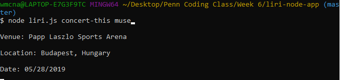

# liri-node-app

This is a CLI app that takes user input and returns information from relevant APIS to the console.
The user inputs can take the forms:
* node liri.js concert-this (band name)
* node liri.js spotify-this-song (song name)
* node liri.js movie-this (movie name)
* node liri.js do-what-it-says

To operate this program on your own computer, you first have to download the files in this github page. Then, you should head to the folder location on Git Bash and run "npm install". This will install the essential node modules that are required in the program. Next, you need to creat a .env file that contains the following format: 

    SPOTIFY_ID=ID
    
    SPOTIFY_SECRET=SECRET
    
    BandsInTown=API KEY
    
    OMDB=API KEY

After each equal sign fill in your own API key. These keys will be called by the keys.js file and then used in the liri.js file.

## Examples:

### concert-this:

This argument takes the band inputted by the user and searches the bandsintown API for info regarding their next concert. If nothing is inputted there is no default search and an error will occur.

### spotify-this-song:

This argument takes the song inputted by the user and searches the Spotify API for info about the song. The default search if nothing is entered is "The Sign".

### movie-this:

This argument takes movie inputted by the user and returns relevant information about the movie via the OMDB API. The default search if nothing is entereed is "Mr. Nobody".

### read text file:

This argument reads the random.txt file for what functions to run and what the search term should be. It really has no point but I was told to do it.

### log:

Every result is appended to the log.txt file.
